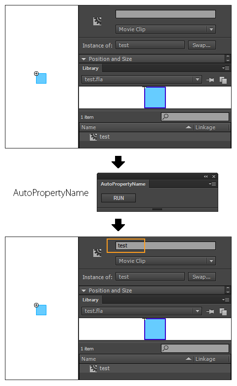

AutoPropertyName
=======

AutoPropertyName is extension panel(JSFL) for Flash Pro CC.

AutoPropertyName は Flash Pro CC 用拡張パネル・JSFL です。

A symbol name of the MovieClip or Button symbol on the stage is set as a property name.

ステージ上に配置している MovieClip, Button シンボルに対し、
ライブラリで設定しているシンボル名と同名のプロパティ名を設定します。

Nondisplay or a rock layer is ignored.

非表示・ロックレイヤーは無視されます。

When more than one same symbol is arranged, the same property name is set as all symbols.

同じシンボルをステージ上に複数配置した場合、すべてのシンボルに対し同名のプロパティ名が設定されるためご注意ください。

---
## Download zxp (Flash Pro CC)

* [AutoPropertyName.zxp](https://raw.github.com/siratama/AutoPropertyName/master/download/AutoPropertyName.zxp)

This can be used by Flash CC 13.1 or later. In the case of Windows, it can save from a right-click. 
[Extension Manager Command Line tool(ExManCmd)](https://www.adobeexchange.com/resources/28) is required in order to install. 

Flash CC 13.1 以降のバージョンで利用可能です。Windows の場合、右クリックから「リンク先のコンテンツを保存」を選択で保存できます。
インストールには別途 [Extension Manager Command Line tool(ExManCmd)](https://www.adobeexchange.com/resources/28)が必要です。

## Download jsx (Flash Pro any version)

* [AutoPropertyName.jsx](https://raw.github.com/siratama/AutoPropertyName/master/download/AutoPropertyName.jsx)
